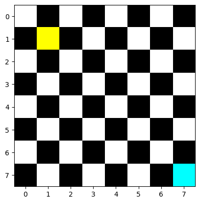

June 27, 2023 MORE DATA SCEIENCE

Warmup1
# Given nested lists of integers, write some code that will add 2 to each one.
#
# Input:
#
# [[1, 2, 3] , [4, 5, 6]]
#
# Output:
#
# [[3, 4, 5], [6, 7, 8]]
___________________________
ATTEMPT
List1: [[1, 2, 3] , [4, 5, 6]]
List2: [[3, 4, 5], [6, 7, 8]]

def addTwo
if List1.is_empty 
  return None
if List2.is_empty
  return None

for List1

return newList

SOLUTION
The first thing we need to worry about is the first outer list.
[1, 2, 3]

def add_2(lst):
  ((This goes over our first list but, not our index))
  for items in lst:
      ((This goes over the numbers in our list))
    for num in items:
        num += 2
    return lst

if __name == '__main__':

lst = [[1, 2, 3] , [4, 5, 6]]
print(add_2(lst))
We need to look at the outer most data structure first.

THIS method does not modify our list. How do we do this? enumerate

def add_2(lst):
  for items in lst:
    for i, num in enumerate (items):
        num += 2
        items[i] = num
    return lst

num += 2 updates items[i] = num

python3 warmup.py
This will run our code
_____________________________________________________________
Warmup2
Given a list of month, print the month and integral value of that month.
Write a function, of name of the month, as well as the numeric represenation of the month.

ATTEMPT
list = [jan1, feb2, mar3, apr, may, june, july, aug, sep, oct, nov, dec]

def month(lst):
  for items in lst:
    for i, num in enumerate(items)
      num += 1
      items[i] = 

return [jan(1), ]

SOLUTION
list1 = list = ['January', 'February', 'March', 'April', 'May', 'June', 'July', and 'August', 'September', 'October', 'November', 'December']

def print_months(lst)L
  for month in lst:
    print(f'{month} : {i + 1}')

  lst = [ [1, 2, 3] , [4, ,5 ,6]]
You need the list because an index of arrays always start at 0.

_____________________________________________________________
Code challenge 11 Review
This is how we get to the first person in line
5 4 3 2 1

5   1
4   2
3   3
2   4
1   5
remove 1, move stack back
5
4
3
2
newList 6 , 5, 4, 3, 2,
add 6
2
3
4
5
6
_____________________________________________________________
Lab 11 Review
board = ChessBoard()
board.render()
board.add_blue(7,7)
board.add_red(1,1)
board.render()
print(board.is_under_attack())

This is a viable solution. First come to a solution and THEN try to find a more effecient way.

Is there one single way that is the best? No. Are there ways that are longer? Yes, but if they work then they are viable.
_____________________________________________________________
PANDAS

New Kaggle: Jupyter notebook
Add Data: Search for things that you want to add

Pandas dataframe
df = dataframe

filename = filepath
df = pd.read.csv(filename)

In order to look at some of the data:
df.info()

How do we reference two different lists?
df [ ['name', 'calfories', 'sugards ] ]
Must have two [] brackets. There is no reasonable explanation that makes sense.
We do not need to add .head at the end because there is no head for our list.

What happens if we want to do some sorting?
df [['name', 'sugars', 'rating']].sort_value('rating')

This didn't work. Where would we look when we want to find a specific command? We look in the documentation!

Statistics
mean, median, and mode.
Mean: Average
Median: Middle
Mode: Most

median_carb = df

max_carb = df('carbo').max()
max_carb

If Standard Deviation is high, farther apart
If Standard Deviation is low, closer together
https://www.mathsisfun.com/data/standard-deviation.html

Make sure you play around with the docs. There isn't just one single way to do this.

Maybe even go back to SQL (personal note)

for thing in sugars
  print(thing):
_______________________________________________________
Lab 12

In your name and the date inside of the markdown

Reminder: FIFO means First In First Out, this is in reference to a queue.